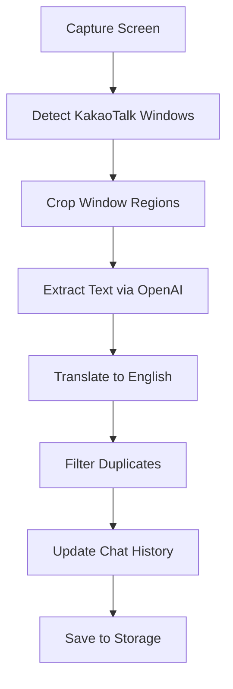

# KakaoTalk Translation Agent

A powerful macOS application that automatically translates Korean messages from KakaoTalk into English in real-time. This project was born out of the frustration of manually copying and pasting messages for translation, providing a seamless solution for bilingual communication.

## 🖼 App UI Preview

Below is a screenshot of the application's user interface:


## 🎬 App Demo Video

Watch how the app works in action:

[](https://www.youtube.com/watch?v=XppslPiiv28)

[Click here to watch the full demo on YouTube](https://www.youtube.com/watch?v=XppslPiiv28)

## 🌟 Features

- **Real-time Translation**: Automatically captures and translates new KakaoTalk messages
- **Smart Window Detection**: Identifies and processes multiple KakaoTalk chat windows
- **Duplicate Prevention**: Intelligently filters out duplicate messages
- **Persistent Storage**: Saves chat history and translations for future reference
- **Modern UI**: Clean and intuitive interface with a split-view design
- **Unread Message Tracking**: Keeps track of new messages with unread counts

## 🎯 Problem Solved

Before this application, users had to:
1. Manually copy each Korean message
2. Open a translation service
3. Paste and translate
4. Copy the translation back
5. Repeat for every message

This process was time-consuming and disrupted the natural flow of conversation. The Translation Agent solves this by automating the entire process, allowing users to focus on the conversation rather than the translation mechanics.

## 🛠 Technical Implementation

### Architecture

The application is built using SwiftUI and follows the MVVM (Model-View-ViewModel) architecture pattern:

```
Translator-Agent/
├── Views/
│   ├── ContentView.swift
│   └── ChatDetailView.swift
├── ViewModels/
│   ├── ScreenshotViewModel.swift
│   └── ChatListViewModel.swift
├── Services/
│   ├── ScreenCaptureService.swift
│   ├── OpenAIVisionService.swift
│   └── StorageService.swift
└── Models/
    └── Chat.swift
```

### Key Components

1. **Screen Capture Service**
   - Captures KakaoTalk windows using macOS screen capture APIs
   - Intelligently crops and processes window regions

2. **OpenAI Vision Service**
   - Utilizes OpenAI's Vision API for text extraction and translation
   - Handles both Korean text recognition and English translation

3. **Storage Service**
   - Manages persistent storage of chat history
   - Implements efficient data serialization and deserialization

4. **Screenshot ViewModel**
   - Core business logic for message processing
   - Handles window detection, message filtering, and chat updates
   - Implements duplicate detection using Levenshtein distance

### Message Processing Flow



## 🔧 Technical Details

### Duplicate Detection
- Uses Levenshtein distance algorithm for message similarity
- 90% similarity threshold for duplicate detection
- Considers sender information in duplicate checking

### Performance Optimizations
- Efficient window detection using CGWindowList APIs
- Smart caching of translations
- Asynchronous processing of messages
- Optimized UI updates with minimal redraws

### Security
- Secure storage of API keys
- Local storage of chat history
- No data transmission to third parties except for translation

## 🚀 Getting Started

1. Clone the repository
2. Open `Translator-Agent.xcodeproj` in Xcode
3. Add your OpenAI API key in the configuration
4. Build and run the application

## 📝 Requirements

- macOS 13.0 or later
- Xcode 15.0 or later
- OpenAI API key
- KakaoTalk desktop application

## 🤝 Contributing

Contributions are welcome! Please feel free to submit a Pull Request.

## 📄 License

This project is licensed under the MIT License - see the LICENSE file for details.

## 🔑 API Key Setup

To use this application, you need to set up your OpenAI API key. There are two ways to do this:

### Option 1: Environment Variable (Recommended)
Set the `OPENAI_API_KEY` environment variable:
```bash
export OPENAI_API_KEY='your-api-key-here'
```

### Option 2: UserDefaults (Development Only)
You can set the API key programmatically in development:
```swift
AppConfig.setAPIKey("your-api-key-here")
```